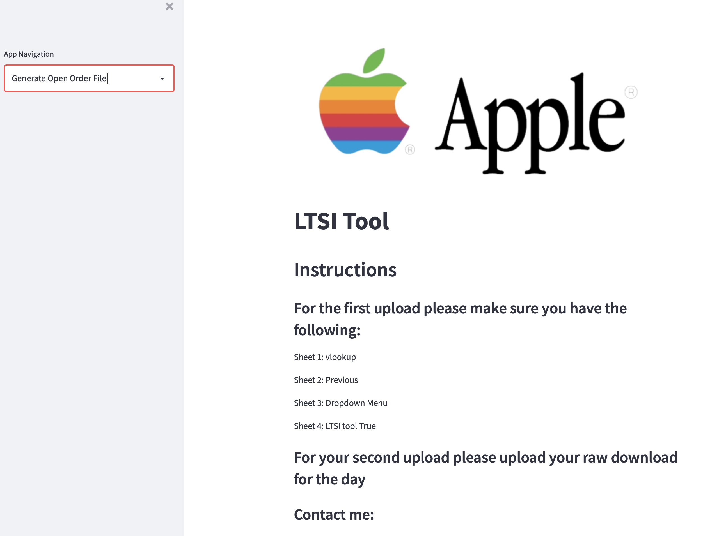
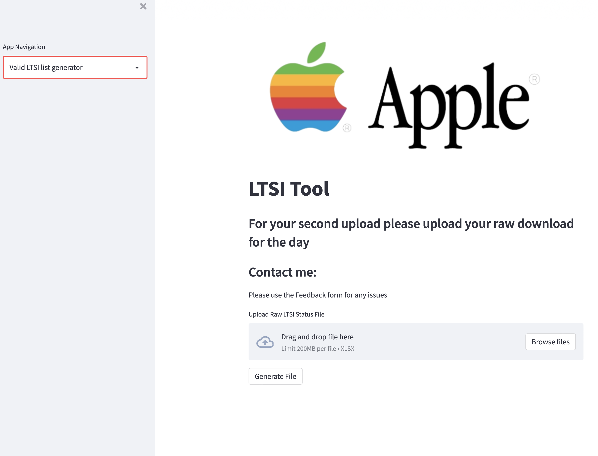
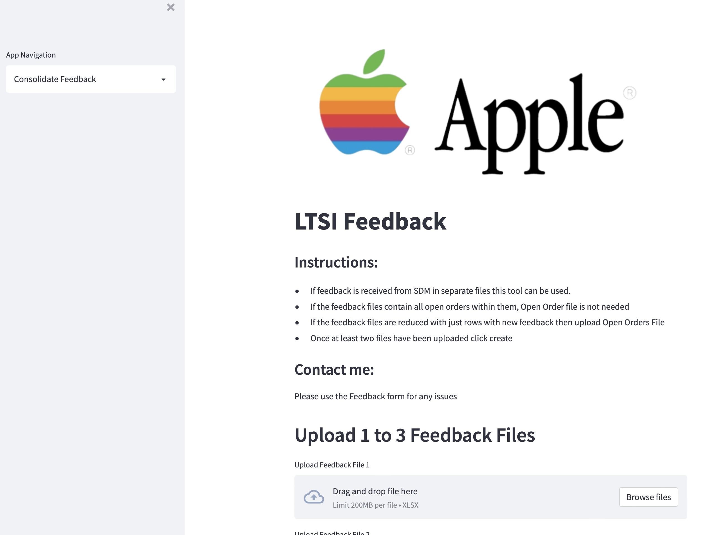
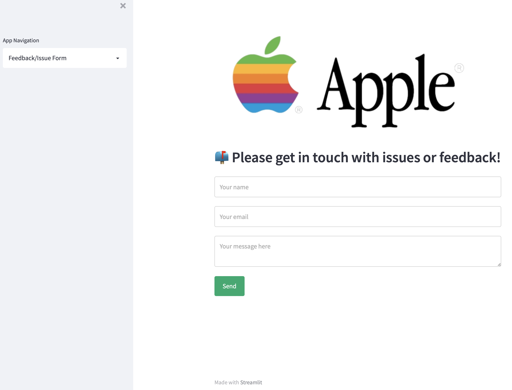

# LTSI Automation Tool

---
## Description
- The motivation behind this tool was to find an easy to use solution to a highly manual task. 
- I built this tool to automate the task and thus improve team efficiency, accuracy and overall output. 
- By creating this tool I hope to save the team between 8-10 hours per week. 
- I learned a great deal about data manipulation in pandas and about deploying a project for others to use. 

---

## Table of Contents
- [Installation](#Installation)
- [Usage/ Instructions](#Usage)
- [License](#license)

---

## Installation
No install is required to run this project. Instead just follow the following link:

https://share.streamlit.io/cameronlooney/ltsi-master-app/app.py

---

## Usage 
### LTSI Open Orders Page
<kbd>

</kbd>

#### **Instructions** 
**Step 1**: Prepare the Helper File as normal  
**Step 2**: Once the file is prepared ensure you have 4 sheets and the order is correct.  
**Step 3**: Download raw LTSI file from FrontEnd.  
**Step 4**: Upload both EXCEL files in the correct locations.  
**Step 5**: Generate output.
 
 

### Valid LTSI List Generator
<kbd>

</kbd>

#### **Instructions**
**Step 1**: Download raw file with LTSI list.  
**Step 2**: Upload file to tool.  
**Step 3**: Generate output.  
**Step 4**: Add LTSI list to Helper File.
 
 

### Consolidate Feedback
<kbd>

</kbd>

#### **Instructions**
**Step 1**: Gather feedback files from SDM.  
**Step 2**: Upload 1-3 files with feedback to tool.  
**Step 3**: If **any** of the files are shorter than Open Order file. Upload your Open Order file.  
**Note:** Open Order can be uploaded even if the files are all the full length.  
**Step 4**: Generate updated Open Order File
 
 

### Feedback/ Issue Form
<kbd>

</kbd>

#### **Instructions**
**Step 1**: Add name.  
**Step 2**: Add email.  
**Step 3**: Add message 
Please be as descriptive as possible if problem is encountered. Include the error message and also the steps to reproduce the error if possible.   
**Step 4**: Send message and I will get back to you as soon as possible.
 
 

---

## License 
All rights are owned by Apple Computer, Inc.

---
